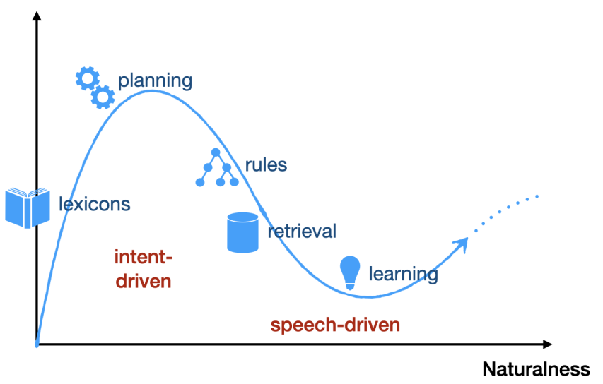

# A Comprehensive Review of Data-Driven Co-Speech Gesture Generation

## Abstract

- Gestures that accompany speech are important for natural and efficient embodied human communication.
- Automatic generation of co-speech gestures is a long-standing problem in computer animation and is considered enabling technology for creating believable characters in film, games, and virtual social spaces, as well as for interaction with social robots.
- The problem is challenging due to the idiosyncratic and non-periodic nature of human co-speech gesture motion and the great diversity of communicative functions that gestures encompass.
- There is a surge of interest in gesture generation due to the emergence of larger datasets of human gesture motion and strides in deep-learning-based generative models that benefit from the growing availability of data.
- The article summarizes co-speech gesture generation research, focusing on deep generative models.
- The theory describing human gesticulation and how it complements speech is articulated, and rule-based and classical statistical gesture synthesis is briefly discussed before delving into deep learning approaches.
- Input modalities are employed as an organizing principle, examining systems that generate gestures from audio, text, and non-linguistic input.
- The evolution of related training datasets in terms of size, diversity, motion quality, and collection method is chronicled.
- Key research challenges in gesture generation are identified, including data availability and quality, producing human-like motion, grounding the gesture in the co-occurring speech in interaction with other speakers and the environment, performing gesture evaluation, and integration of gesture synthesis into applications.
- Recent approaches to tackling the key challenges, as well as their limitations, are highlighted, and areas of future development are pointed toward.

## 1. Introduction

- The paper focuses on co-verbal gesture, which accompanies speech.
- Gesture plays at least three main functions:
  - Making artificial agents and robots look more alive and engaging
  - communicating functional information
  - And communicating social information.
- Functional information can include pointing, deictic gesture, emblems, and imagistic metaphoric and iconic gestures.
- Social information communicated through gesture can include personality, emotion, and subtext.
- Gestures communicate in a different way than spoken language and can support a range of applications for virtual agents and robots.
- It has been established that gestures do indeed communicate, and there are three main findings for when gestures communicate according to Hostetter’s meta-analysis: gestures depicting motor actions are more communicative than those depicting abstract topics, gestures that are not completely redundant have a larger impact on communication, and children benefit more from gesture than adults.

Overall, our survey makes the following contributions to the field:
A detailed discussion on the theory and motivation for co-verbal gesture synthesis.

- A discussion on rule-based and statistical techniques, illustrating how these approaches can complement the strengths and weak-nesses of recent deep-learning approaches.
- An emphasis on deep-learning-based generation systems using input modality as an organizing principle for the research.
- A discussion on the most commonly used speech-to-gesture datasets, collected via motion capture or pose estimation.
- Identifying and detailing a set of key challenges for co-verbal gesture synthesis and potential research directions.

## 2. Human gesticulation

## 3. Approaches for gesture synthesis

Hình 4 minh họa sự phát triển này và sự đánh đổi giữa tính tự nhiên và hiệu quả trong truyền đạt thông tin của các phương pháp khác nhau.

## 4. Rule-base approaches

Cassell et al. [CPB∗ 94] presented Animated Conversation, the first rule-based system to automatically generate context-appropriatehand gestures, facial movements and intonation patterns betweenmultiple human-like agents. Notably, this work was one of the firstto explore the latent relationship between speech and gesture forgenerating realistic animation. The system initiated a dyadic in-teraction between two agents through a dialogue generator andplanner. The generated text was transformed into speech througha text-to-speech system [LB85] and deep symbolic representa-tions were used to encode timing, intonation and the correspondinggesture prototypes. The gesture prototypes were used to performthe full gesture. The result was agents with appropriate and well-synchronized speech, intonation, facial expressions and hand ges-tures. However, the system was limited to domain-specific dialoguegeneration between two agents, which not only restricted free-form conversation (by restricting the discourse) and gesture animation,but also precluded real-time interaction with a human user.

Thórrison proposed Ymir, [Thó96] which improved on the Ani-mated Conversation framework by enabling multimodal input froma user, including speech, gaze, gesture and intonation. It con-sisted of multiple modules for input perception, dialogue gen-eration, decision making and action schedulers in order to pro-duce well-synchronized hand animation. However, although thisoffered more interactivity with a user, the system could only pro-duce limited multi-modal output in real time. The work of Cassellet al. [CBC∗ 00] subsequently improved on the two frameworks byintegrating the real-time multi-modal interactivity of Ymir with thesymbolic generation and richer multi-modal synthesis capabilityof Animated Conversation. The result was an embodied conver-sational agent framework that produced reactive characters that be-haved intuitively and robustly in conversations, albeit still limitedto dialogue deriving from a static knowledge base.

Another of the seminal works in a rule-based generation was theBehaviour Expression Animation Toolkit proposed by Cassell etal. [CVB01]. BEAT took typed text as input and could synthesizewell-synchronized speech, gesture, facial animation and intonation.The system used contextual information latent in the text to choosepre-recorded hand, arm and facial movements by relying on a setof carefully designed heuristics from previous nonverbal conver-sational behavior research. BEAT was highly extensible allowinganimators to insert new rules that parameterize personality, move-ment characteristics, scene constraints and desired animation style.

Alternatively, Kopp et al. [KW02] proposed a model-based ap-proach for generating complex multimodal utterances (i.e. speechand gesture) from XML specifications of their form. Instead ofrelying on pre-recorded gestures, as the previously discussed ap-proaches did, the system applied non-uniform cubic B-Splines toform a gesture trajectory that satisfies all velocity and position con-straints. The authors demonstrated the multimodal capabilities ofthe system through Max: a virtual reality-based agent that inter-acts and assists a human user through construction tasks, by usingprosodic speech, deictic and iconic gestures, gaze and emotive fa-cial expressions [KJLW03].

Facial expressions, gaze direction and head movements are es-sential non-verbal behaviors that communicate the intent and emo-tional state of a speaker. They can also act as facial gestures e.g.“raised eyebrow” or gaze direction utilized to resolve a refer-ent object or direction. Therefore, endowing virtual agents withsuch qualities can make them more anthropomorphic. Pelechaudet al. [PCDC∗ 02], developed Greta: a 3D virtual agent whose fa-cial gestures communicated the agent’s emotional state. The sys-tem was designed as a BDI agent (i.e. prior Beliefs, Desires andIntentions) [RG91]. A Dynamic Belief Network (DBN) modelledGreta’s constantly evolving emotions and computed the triggeringthresholds and evolution of her emotions, resulting in emotive ver-bal and non-verbal behaviour.

The development of new rule-based systems often necessitatedthe development of a new domain-specific language (DSL), usu-ally based on XML. Examples of these include an XML process-ing pipeline in the BEAT system [CVB01], MURML for mul-timodal behavioral planning and animation of Max [KJLW03,KKW02], APML for representing the agent’s behaviour semanti-cally [CPPS04], and RRL for representing simulations of multi-modal dialogue [PKS∗ 04]. However, these DSLs were often in-compatible with each other even as the systems solved similaror overlapping objectives. As a result, a group of researchers de-veloped a unified language for multimodal behaviour generationfor virtual agents, called the Behavior Markup Language (BML)[KKM∗ 06, VCC∗ 07]. BML was designed in the context of a com-prehensive framework with intent planning, behavior planning andbehavior realization stages. Within this framework, BML describedthe desired physical realization and thus connected behavior plan-ning to behavior realization. BML became the standard format forrule-based systems, finding use in open-source frameworks likeSmartBody [TMMK08], and other agent embodiments like hu-manoid robots [LHP11].

The development of BML led to continued advances in rule-based systems, even as some research started to explore learning-based systems. For instance, Marsella et al. [MXL∗ 13] generatedfacial expressions and behaviors (including gestures, head move-ments, eye saccades, blinks and gaze), for a 3D virtual character,by analyzing the prosodic and acoustic features of speech, as wellas shallow analysis of the utterance text to determine rhetorical andpragmatic content. Ravenet et al. [RPCM18] generated metaphor-ical gestures by leveraging BML to extract metaphorical proper-ties from input speech. Their system leveraged BML annotationsto synchronize speech audio and gestures, and configure gesturecharacteristics (e.g., hand shape, movement, orientation) to conveythe desired representational meaning during behavior realization.Overall, BML continues to be a standard domain-specific languagefor behavior planning and realization in rule-based gesture genera-tion systems.

Rule-based gesture generation systems can produce high-qualitygestures that are well synchronized with speech. Due to their re-liance on pre-recorded motion, hand animation or carefully en-gineered systems for generating gestures, rule-based systems canhave better motion quality than learning-based systems. Hand-tuned rules may also better preserve semantics within their lim-ited domain. However, the gesture distribution is often not diverse.Moreover, the carefully designed rules require significant expertknowledge which is laborious and not scalable. Such systems areinflexible in that they can only produce a small set of plausiblegestures for a particular speech input or scenario. Therefore, the in-ability to produce diverse gestures in a non-deterministic mannermeans the resulting virtual agents (or any other embodiments) canonly behave in an expressive and naturalistic way for limited exam-ples. Data-driven methods were proposed to try to overcome theselimitations. Given the overall advances in deep learning, they mayeventually also produce the highest quality motion. We review thetwo data-driven sub-categories next, statistical and deep learning-based methods.

## 5. Data-driven approaches

### 5.1 Speech-Gesture Datasets

Any data-driven method is fundamentally limited by the data it istrained on. The number of datasets suitable for machine-learningon human gesture data has been steadily rising, as has their size.Table 1 provides an overview of major datasets for gesture gen-eration, and their characteristics such as size, motion format (2Dor 3D), modalities, included annotation, and more. It is seen thatthe dataset sizes have reached new heights of 100+ hours in recentyears, and there is also greater diversity in terms of the number ofspeakers, thanks to 3D pose estimation from video. Unfortunately,only a small fraction of datasets contain high-quality finger motion,which is of great importance for generating expressive and mean-ingful gestures.

There are two main methods for obtaining motion data forgesture synthesis: optical motion capture [MYL∗ 16, TKS∗ 17,LDM∗ 19,JSCS19,FM18] or pose estimation from monocular video[YKJ∗ 19, ALIM20, JKEB19, KNN∗ 22, HXM∗ 21].Existing datasets recorded using motion capture are usuallysmaller, since that method of data collection is much more expen-sive and labor-intensive, and generally takes place in a controlledstudio environment. Emotion is often acted. The main advantagesof the resulting data is that movements are in 3D and have highquality. This method is also the best at capturing finger motion.Datasets instead obtained from pose estimation can be an orderof magnitude larger, as they can be sourced from online videos.This enables finding genuine, in-the-wild gestures, and the materialcan be large enough to include much more diversity. The downsidesare relatively lower motion quality (fingers being especially hard)and being limited to 2D motion only. Recent monocular video workhas lifted the skeleton motion to 3D [HXM∗ 21].

In practice, the amount of data needed is likely to depend onthe application at hand. While gathering data from a specific tar-get speaker of interest is usually better than having an equivalentamount of data from non-target speakers, the gesture manifolds ofdifferent speakers nonetheless often have a significant overlap. Ithas been found that, starting from a generative model trained on oneindividual style, one requires only two minutes of data to fine-tune agesture generation model for another style [ALM22]. Recent workhas also demonstrated the possibility of learning to embed differentgesture styles, which then can be used for zero-shot adaptation tothe style of an unseen target speaker with no training data of the tar-get speaker [FGPO22, GFH∗ ]. Techniques for augmenting gesturedata so as to increase the amount of motion data for training havealso been studied, especially mirroring [WTGM22b, WTGM22a].

### 5.2. Statistical and early machine learning approaches

In statistical systems, the latent relationship between speech andgesture is modeled by the statistics of the underlying gesture dis-tribution, instead of being encoded by an expert. Compared torule-based systems, statistical approaches make fewer assumptionsabout the speech-gesture association, instead either pre-computingconditional probabilities for the gesture data or assigning a priorprobability distribution. Similar to our approach in Section 4, wefocus on a subset of statistical approaches that, in our estimation,are some of the most impactful in the field. The works are describedin chronological order to illustrate advances in statistical systems.

Kipp proposed one of the earliest statistical systems, which mod-eled an individual’s gesture by analyzing an annotated co-speechdataset and producing a gesture profile [Kip05]. The data was an-notated using the video annotation tool ANVIL [Kip01] to define agesture profile consisting of individual properties such as handed-ness, timing and communicative function. The gesture profiles werethen modeled using statistical models inspired by work in speechrecognition and dialogue act recognition [RK97]. The plausibilityof a gesture was estimated using conditional probabilities on ges-ture bi-grams, and the occurrence of the gesture given semanticsfrom input text. The result was statistical models for an individual’sgesture properties like handedness, transitions and timing, formingan individual’s gesture profile. The profiles were then used to gen-erate plausible gestures from annotated input speech. The genera-tion process had distinct stages: 1) Assigning semantic tags to inputtext; 2) Generating all possible gestures, adding them to an inter-mediate graph representation, and assigning probability estimatesto the graph; 3) Filtering and temporal placement of gestures us-ing text-gesture associations and timing profiles, respectively. Thefinal output was an XML action script that could be used in a down-stream animation system.

Extending this approach, Neff et al. [NKAS08] proposed a statis-tical system that learned gesture profiles but also added a character-specific animation lexicon. The system had two distinct phases.The pre-processing stage started with a video corpus of a char-acter, hand-annotated in ANVIL [Kip01]. The annotation processwas similar to that of Kipp [Kip05], but with an additional English-speaking character. Given the annotated data, a gesture profile (astatistical model) and animation lexicon were created, where thelatter consisted of hand orientation, torso posture and data for after-strokes (i.e. subsequent repeated hand movements after a promi-nent stroke), for each gesture lexeme. The full-automated gener-ation phase had two distinct paths: 1) re-creation that took in anannotated video as input and could re-create the gestures (observedin the video) in the animation system, useful for validating the an-notations; 2) gesture generation that could generate gesture fromnovel annotated text without the need for video input. Either pathleveraged the character’s gesture profile to generate a gesture script.The gesture script was used in the animation engine to generate thefinal animation either through a kinematic or dynamic simulationalgorithm.

Bergman and Kopp proposed a different statistical approach forsubmitted to EUROGRAPHICS 2023.modeling the transformation of speech that describes objects intoiconic gestures that resemble said objects [BK09b]. The proposedsystem generated coordinated speech and gesture by leveragingpropositional and imagistic knowledge representations for contentplanning and concrete speech and gesture formulation. Their workinvolved dyadic conversations where one speaker gives spatial di-rections to another after exploring a virtual environment in VR. Thestudy investigated what contextual factors are important in the for-mation of speech and gesture describing physical objects. As partof their framework, they developed a Bayesian network for ges-ture formulation. The Bayesian network defined a probability dis-tribution over gesture properties such as indexing, placing, shaping,drawing and posturing. The probability distribution also took intoaccount the idiosyncratic patterns for mapping visuospatial refer-ents onto gesture morphology, i.e. the specific way an individualmight index, shape or draw a gesture when describing a referentobject. Gesture formulation resulted in fine-grained features includ-ing hand shape, wrist location, palm direction, extended finger di-rection, movement trajectory and direction. For the final animation,the framework leveraged the rule-based Articulated CommunicatorEngine (ACE) [KW04] to realize synchronized speech and gesture.

Bergman and Kopp closely followed up with a hybrid frame-work combining data-driven and model-based techniques to modeliconic gestures using Bayesian decision networks [BK09a]. Theyused a similar corpus of dyadic interactions with spontaneousspeech and gesture employed for direction giving and landmark de-scription. The corpus was richly annotated with temporal segments,gesture morphology and references to objects for iconic gestures.Extending their earlier work that used Bayesian networks [BK09b],they used Bayesian decision networks, supplemented by decisionnetwork nodes [HM05]. Bayesian decision networks enabled themto formulate gesture generation as a finite sequential decision prob-lem by combining probabilistic and rule-based components. For ex-ample, the decision to include a certain gesture or the morphologyof the gesture could be encoded as a decision node (activated bya rule) or chance node (activated by probability) with a specificprobability distribution. To generate a gesture, the Bayesian net-work defined a probability distribution over gesture morphologicalfeatures, based on object referent features, discourse context andthe previously performed gesture.

Levine et al. proposed a hidden Markov model (HMM) to se-lect the most suitable motion clip from a motion capture database,by using prosody-based features extracted from the original speech[LTK09]. The trained HMM used prosody cues to select the mostappropriate gesture sub-units from the motion capture, ensuringthat the chosen sub-units transition smoothly and are appropriatefor the tone of the current utterance. However, directly associatingprosody with gesture sub-units created a dependence on the qual-ity and amount of training data, which made the system susceptibleto overfitting. Levine et al. [LKTK10] improved upon the previ-ous system by proposing “gesture controllers” that decoupled thekinematic properties of gestures (e.g. velocity, spatial extent) fromtheir shape. Gesture controllers inferred gesture kinematics using aconditional random field (CRF) that analyzed the acoustic featuresin the input speech and learned a distribution over a set of hid-den states. The hidden states encoded the latent structure of gesturekinematics without regard for the morphology of the gesture whichreduced the number of false correlations and thus alleviated over-fitting. Finally, a Markov Decision Process (MDP) took the hiddenstates and the distribution over them as input and used an optimalpolicy (learned via the reinforcement learning algorithm) to selectthe appropriate gesture clips.

Chiu et al. [CM11] maintained the use of prosodic featuresto learn a probabilistic model for gesture generation. They re-stricted their study to learning gesture types that are associated withprosody, i.e. rhythmic movements (beats). The gesture generatorwas based on a modified Hierarchical Factored Conditional Re-stricted Boltzmann Machine (HFCRBM) [TH09]. They first built acompact motion representation by training a conditional RestrictedBoltzmann Machine (CRBM) using an unsupervised learning algo-rithm. Then the HFCRBM generator autoregressively took in theprevious gesture representation and a sequence of audio featuresextracted from the original speech to generate the gesture represen-tation for every time step, until the full motion sequence was com-pleted. Finally, they smoothed discontinuities between frames byreducing the acceleration of wrist joints if they exceed a set thresh-old. However, their approach was restricted to rhythmic gesturesand thus did not consider other commonly occurring gesture typessuch as iconic, pantomimes, deictic, emblematic and metaphoric.Recently, Yang et al. [YYH20] proposed a statistical motion-graph-based system that generated gestures and other body mo-tions for dyadic conversations, that were well synchronized withnovel audio clips. They constructed a motion graph that preservedthe statistics of a database of recorded dyadic conversations. Dur-ing generation, the graph was used to search for the most plausiblemotion sequence according to three constraints of audio-motioncoordination in human conversations: 1) coordination to phone-mic clause; 2) listener response; 3) partner’s hesitation pause. Thesystem adapted motion graphs, successfully employed in locomo-tion [LCR∗ 02, KGP02, AF02, TLP07], for free-form conversationgestures with a lot more stylistic variation. Their conversationalmotion graph was significantly larger than that for locomotion dueto the richness of conversational gestures. Given such a large graph,the system balanced search efficiency and style diversity by lever-aging a stochastic greedy search algorithm to find a high-qualityanimation, well synchronized with the audio.

Statistical models provide more flexibility than rule-based sys-tems and capture the non-determinism found in conversational ges-tures. In fact, a lot of the statistical principles (i.e. learning a prob-ability distribution over the gesture data, through maximum likeli-hood estimation (MLE)) are still useful and relevant to most state-of-the-art methods, currently dominated by deep learning-basedmodels. However statistical systems usually considered a limitednumber of independent variables based on painstakingly annotatedgesture data. Deep learning-based models provide more flexibilitythrough great representative capacity as well as making even fewerassumptions about the statistics of the underlying data. We describethis family of models next.

### 5.3. Deep learning approaches

Deep learning-based generative models recently gained interest be-cause of their ability to synthesize data from abstract representa-tions of training datasets. They are increasingly prominent in char-acter animation applications, including character control in games,and facial or gesture animation conditioned on speech and text invirtual agents. Such models typically make few assumptions aboutthe underlying data distribution (except useful inductive biases),and learn their parameters to fit the data through gradient-basedoptimization of an objective function.

The use of deep-learning approaches has moved the field for-ward substantially in terms of perceived naturalness, but arguablyrepresents a step backwards in terms of communicative efficacywith respect to previous methods, as illustrated in Figure 4. In-stead, the main targets of systems based on deep learning havebeen human-likeness and appropriateness for speech audio andsemantic content. The former is the degree to which the gener-ated gesture motion visually resembles believable human behav-ior, while the later is how suitable it is for a given speech au-dio, text input, or other contextual information. Early deep-learningsystems ignored semantics, instead focusing on improving human-likeness [AHKB20,KHH∗ 19,FNM20]. Later approaches have triedto incorporate semantics in order to generate meaningful gestures.The first attempts could generate only a handful of such gestures[KJvW∗ 20, YCL∗ 20, ALIM20]. Although more recent work sug-gest that progress can [KNN∗ 22] and has been made [AGL∗ 22],appropriateness remains a challenge. This can be seen from the GE-NEA Challenge (where GENEA stands for Generation and Evalu-ation of Non-verbal Behavior for Embodied Agents), which is a re-curring large-scale comparison of gesture synthesis systems, whosemost recent iteration [YWK∗ 22] found that the human-likeness ofmotion can now reach the level of human motion capture, whileappropriateness is still barely above chance.

The proliferation of deep learning in conversational gesture gen-eration has led to a large number of approaches that can be groupedbased on the input modalities, i.e. audio, text, audio and text, or au-dio with other non-communicative modalities, and control parame-ters. We employ this taxonomy to organize our exposition and givea summary of the models and their respective categories in Table 2.We only include approaches that produce hand gestures and werepublished before the submission deadline for our review. In sec-tions 5.3.1, 5.3.2, and 5.3.3 we discuss generation approaches thatuse audio-only, text-only, and a combination of audio and text in-put, respectively. Section 5.3.4 focuses on approaches that use non-linguistic input, i.e. input other than speech audio or text. Finally,Section 5.3.5 explores approaches that employ control input. Theapproaches within each modality section are presented in chrono-logical order to reflect the evolution of the field.

#### 5.3.1. Audio input

Hasegawa et al. [HKS∗ 18] proposed an autoregressive approachto generate gesture from audio utterances using a bi-directionalLSTM [HS97]. The bi-directional LSTM learned audio-gesture re-lationships with both backward and forward consistencies over along period of time. The model was trained with a then novel audio-gesture dataset, collected using a headset and marker-based motioncapture [TKS∗ 17]. The model predicted a full skeletal human posefrom the utterance features input at every LSTM timestep. Tem-poral filtering was then used to smooth out discontinuities in thegenerated pose sequences.Kucherenko et al. [KHH∗ 19] extended the work of Hasegawa etal. [HKS∗ 18], removing the need for temporal smoothing throughrepresentation learning of an autoencoder. The proposed modeltransformed audio input into a gesture sequence in the form of3D joint coordinates. They achieved this by (i) learning a lowerdimensional representation of human motion using a denoising au-toencoder consisting of a motion encoder (called MotionE) and amotion decoder (called MotionD) and (ii) training a novel speechencoder (called SpeechE) to transform speech to the correspondingmotion representation with reduced dimensionality. During infer-ence, the SpeechE predicted the motion representations, based ona given speech signal, and the MotionD decoded the motion repre-sentations into gesture sequences. However, their approach was de-terministic and thus unable to capture the commonly observed phe-nomena where a person gesticulates differently at different pointsof the same utterance.

Deterministic generative approaches usually learn their param-eters using a regression objective, e.g. L1 (Mean Absolute Error)or L2 (Mean Squared Error). Optimizing with either of those ob-jectives typically forces the model toward learning to generate themean representation of the data, producing averaged motion for dif-ferent inputs, and resulting in undesirable results; usually calledregression to the mean. Several approaches avoided this by incor-porating probabilistic components into their objectives. Probabilis-tic components can increase the range of gesture motion in mul-tiple ways, namely: (i) greater range of motion for different in-puts, or (ii) stochastic motion for the same input. The most promi-nent are implicit log-likelihood evaluation via adversarial learn-ing with Generative Adversarial Networks (GAN) [GPAM∗ 14],explicit log-likelihood evaluation via variational inference withVariational Autoencoders (VAE) [KW13], and exact log-likelihoodevaluation via invertible transformations with Normalizing Flows[KPB20, PNR∗ 19].

GANs aim to do implicit density estimation of the underlyingdistribution through the interplay of a generator that tries to producesamples that are representative of the data, and a discriminator thatstrengthens the generator by classifying samples as real (from thedistribution) or fake (not from the distribution). Multiple gesturegeneration approaches added an adversarial objective as a term ina composite loss function, which increased the range of gesturemotion although still deterministic for a given audio input [SB18,GBK∗ 19,FNM20,YCL∗ 20,ALNM20,RGP21,WLII21b,WLII21a,ZRMOL22, HES∗ 22]. We discuss some notable examples below.Ferstl et al. [FNM19, FNM20] added multiple adversarial objec-tives to a recurrent neural network, known to be susceptible to re-gression to the mean for long sequences. The adversaries accountedfor gesture phase structure, motion realism, displacement and di-versity of the minibatch. Ahuja et al. [ALNM20] learned to implic-itly estimate a mixture of densities, each representing a speaker toenable the transfer of one speaker’s style onto the speech input ofanother. The mixture of densities was estimated by instantiating agenerator (per speaker) that is responsible for generating gesturesthat are representative of that speaker’s underlying gesture distribu-tion. All the generators were trained in unison using the adversarialobjective. Most recently, Habibie et al. [HES∗ 22] used an adver-sarial objective in the form of a conditional GAN to refine gestureclips that were selected using a k-Nearest Neighbour (kNN) searchthat is conditioned on speech and a control signal.Normalizing flows learn to describe highly complex distribu-tions by applying invertible sub-transformations to a simple ini-tial distribution, where invertibility allows one to optimize the ex-act likelihood of the deep generative model via gradient descent[KPB20,PNR∗ 19], unlike in GANs or VAEs. In the context of ges-ture generation, Alexanderson et al. [AHKB20] extended a normal-izing flow-based model for locomotion [HAB20] to apply to speechaudio-driven gesture synthesis with style control. Their normaliz-ing flows learned invertible transformations from simple Gaussiandistributions to the distribution of upper- or full-body motion cap-ture data. These transformations were conditioned on speech acous-tics and, optionally, arbitrary style parameters. Specific style pa-rameters considered included properties such as the average handheight, gesture speed, and gesture radius in a 4-second interval. Theresulting model produced gestures that scored among the best interms of naturalness and appropriateness in the GENEA Challenge2020 [KJY∗ 20].

VAEs aim to do explicit density estimation of the underlying databy optimizing a combination of a reconstruction loss for an autoen-coder (usually an L1 or L2 loss) and the Kullback-Leibler (KL)divergence for distribution matching between a prior distributionand approximate posterior distribution of the data. The prior distri-bution is usually instantiated as a Gaussian for simple parameter-ization. The learned stochastic variables can then be sampled anddecoded into diverse outputs. Recently, Li et al. [LKP∗ 21] useda conditional VAE to translate speech into diverse gestures. Theyexplicitly modeled a one-to-many speech-to-gesture mapping bysplitting the cross-modal latent code into a shared code (audio +gesture) and motion-specific code (gesture only). The shared codemodeled the correlation between speech and gesture e.g. synchro-nized speech and rhythmic gestures. The motion-specific code at-tempted to capture the diversity in gesticulation, independent ofaudio information.

In a similar vein, Ghorbani et al. [GFC22, GFH∗ ], used a VAE-based framework for style controllable co-speech gesture genera-tion conditioned by a zero-shot motion example i.e., an instance ofa motion style unseen during training. Given an audio input anda motion example, they generated an encoding of the audio and astyle embedding from the motion, and the two latent codes wereused to guide the generation of stylized gestures. The variationalnature of the style embedding enabled them to easily modify stylethrough latent space manipulation or blending and scaling of styleembeddings. Moreover, the probabilistic nature of the model en-abled the generation of varied gestures for any audio and exem-plar motion input. The resulting model performed favorably againststate-of-the-art probabilistic techniques [AHKB20] in terms of nat-uralness of motion, appropriateness for speech, and style portrayal.Taylor et al. [TWGM21] adapted the conditional Flow-VAEframework [BHF∗ 19], combining the advantages of the VAE andnormalizing flow architectures,to generate spontaneous gesturemovement for speaker and listener roles in a dyadic interaction.They used the Flow-VAE framework for modeling expressive ges-ture because of its ability to improve generative capacity of theVAE by estimating the latent space with a highly complex distri-bution using a normalizing flow, instead of the standard Gaussian.Their autoregressive framework was trained on a set of previouslygenerated gestures, an audio input window and the dyadic role, i.e.speaker or listener, as input. The preceding gestures were encodedinto a latent variable then transformed into a complex distributionusing a normalizing flow, conditioned by the audio window and rolein the dyad. Their decoder then generated the next gesture basedon the latent variable sampled from the complex distribution. Theresulting model could generate expressive co-verbal gestures in adyadic setting based.

Hybrid systems that combine deep learning and database match-ing components can also help tackle the regression to the meanproblem [KNN∗ 22, ZBC22, FNM21, HES∗ 22]. Indeed, this ap-proach has been used effectively in motion synthesis problems, e.g.game animation where high fidelity motion is crucial [HKPP20].In the context of conversational gesture, the intuition is that mod-eling the association between high dimension audio input and ges-tures, represented by exact joint positions or angles, using stan-dard regression objectives (L1 or L2 loss) discourages the modelfrom producing otherwise plausible gestures that do not exactlymatch the ground truth, thus greatly reducing the variety of gen-erated gestures. Alternatively, the audio-gesture association can bemodeled by predicting higher-level parameters for gesture motion.Ferstl et al. [FNM21] realized this idea by learning to map audio togesture via higher-level expressive parameters, specifically gesturevelocity, acceleration, size, arm swivel angle, and extent of handopening. First they pre-trained a model to associate audio prosodicfeatures to the expressive parameters. Then they predicted gesturetiming by extracting pitch peaks in the audio signal. At inferencetime, the prosodic features were used to estimate the expressive pa-rameters that were in turn used to search for a matching gesture inthe database, and the pitch peaks were used to temporally positionthe matching gesture. Finally, synthetic preparation and retractionphases were added to connect the gestures in the sequence.

Another interesting approach for preserving gesture form isthrough audio-based search in a video gesture database where thegestures are representated by video frames. Zhou et al. [ZYL∗ 22]explored this idea in a gesture reenactment task by generating agesture video for an unseen audio input, using gesture frames froma reference video. They first encoded the reference gesture videoas a “video motion graph” - a directed graph where each node rep-resented a video frame and corresponding audio features, and theedges represented transitions. The graph encoded how the refer-ence video can be split and re-assembled in difference graph paths.In order to increase graph connectivity, i.e, diversity of plausiblepath, they added synthetic edges based on a frame pose similaritythreshold computed using the SMPL pose parameters [LMR∗ 15].Given unseen audio input as a guide, they traversed the graph us-ing a beam search algorithm [RR77] to find the most optimoptimalal pathor order of gesture frames that best matches the speech audio. Forgraph paths that contain temporally disjoint frames, they trainedpose-aware video blending network to synthesize smooth transi-tions between the frames.

#### 5.3.2. Text input

Approaches that used audio as the primary modality producedwell-timed hand movements that tend to be highly associated withacoustics, largely corresponding to beat gestures. However, the lackof text transcript means they were not informed by the structureand context inherent in the text, for example, semantic meaningand punctuation. Such structure can help produce more meaning-ful and communicative gestures. Therefore, next, we describe someapproaches that used text as the primary input modality.

Ishi et al. [IMMI18] proposed a text-based gesture generation ap-proach for controlling a humanoid robot. They modeled the text-to-gesture motion translation by associating words to concepts, con-cepts to gesture categories (i.e. iconic, metaphoric, deictic, beat,emblem and adapter), and gesture categories to gesture motions.Further, they estimated conditional probabilities to model the as-sociation between word concepts and gesture categories, and be-tween gesture categories and gesture motion clusters that were pre-computed with the k-means clustering algorithm.

Yoon et al. [YKJ∗ 19] proposed an encoder-decoder approachthat transformed speech text, from a dataset based on TED talks,into a sequence of gestures. They created the TED video dataset bypicking video segments with the speaker’s upper body and hands.Then they performed pose estimation using OpenPose [CHS∗ 18]and removed segments containing noisy or no estimations. Speechtext was converted into a sequence of 300-dimensional wordvectors using pre-trained GloVe embeddings [PSM14]. Similarly,poses estimations were converted to 10-dimensional vectors us-ing principal component analysis (PCA). Therefore, co-speech ges-ture generation became a sequence-to-sequence translation prob-lem from word embeddings to human poses encodings. The en-coder part of the network was a bi-directional GRU [CVMG∗ 14]taking in speech text one word (vector) at a time and capturing bi-directional context. The last hidden state of the encoder was passedinto the decoder, also a bi-directional GRU. The decoder also tookprevious pose estimations to condition the prediction of the nextpose, in addition to using soft-attention [BCB14] to focus on spe-cific words when predicting the next pose. Finally, the generated2D poses were mapped to 3D and executed on the NAO humanoidrobot.

Recently, Bhattacharya et al. [BRB∗ 21] used text transcripts toproduce expressive emotive gestures for virtual agents in narra-tion and conversation settings, using MPI-EBEDB, a dataset ofactors performing multiple emotion categories (amusement, anger,disgust, fear, joy, neutral, pride, relief, sadness, shame, surprise)[VDLRBM14]. Their approach consisted of Transformer-based en-coders and decoders [VSP∗ 17], where the encoder took in the texttranscript sentences (encoded as GloVe embeddings [PSM14]) toproduce an encoding which was concatenated with the agent at-tributes such as narration/conversation, intended emotion, genderand handedness. The previous pose’s encoded concatenation and3D joint positions were passed as input to the Transformer de-coder to generate the next pose’s joint positions. The process wasrepeated in a recurrent manner until the full pose sequence wasgenerated.

#### 5.3.3. Audio and text input

An interesting trade-off exists between audio-based and text-basedgesture generation systems. audio-based generators have access tointonation and prosody which helps generate rhythmic or kine-matic gestures (e.g. beats) but lack semantic context. Conversely,text-based generators have access to semantic context which helpsgenerate meaning-carrying gestures (e.g. iconic or metaphoric), butlack intonation and prosodic information. Therefore, combining theaudio and text modalities enables a gesture generator to learn toproduce semantically relevant and rhythmic co-speech gestures.Although generating meaning-carrying gestures using audioonly is theoretically possible, it is unlikely since prosody is suitablefor kinematics, but not sufficient to infer shape which is associatedwith meaning [LWH∗ 12]. As far as we know, meaningful gesturesfrom speech audio alone have not been empirically demonstrated.Instead, combining audio with text appears to be the most promis-ing approach to generating meaningful gestures to date. We, there-fore, focus on approaches that combine these two modalities forgenerating meaning-carrying, communicative gestures.

Chiu et al. [CMM15] proposed an approach that combined thetext and prosody of the speech to generate co-verbal gestures. Theirmodel, called the Deep Conditional Neural Field (DCNF), was acombination of a fully-connected network, for representation learn-ing, and a Conditional Random Field (CRF), for temporal model-ing. For the gesture prediction task, the model took in a text tran-script, part-of-speech tags and prosody features as input, and pre-dicted a sequence of gesture signs which were a set of predefinedhand motions.

Leveraging the representation power of deep learning models formultimodal input (i.e. audio and text) for co-speech gesture gener-ation was the next logical step. In fact, three groups of researchersindependently proposed the first deep-learning-based gesture gen-erators that used both audio and text to generate continuous ges-tures, namely Yoon et al. [YCL∗ 20], Ahuja et al. [ALIM20] andKucherenko et al. [KJvW∗ 20]. We discuss their pioneering workcombining audio and text next, followed by subsequent efforts inthe area.

Yoon et al. [YCL∗ 20] proposed a gesture generation approachthat combines the tri-modal context of speech, text and speakeridentity to produce gestures that were human-like, and matchedthe content and rhythm of the speech. The model processed in-put speech and text with a speech and text encoder, respectively.The speaker identity was used to sample the intended speaker froma learned style embedding space. Together the three features (i.e.speech encoding, text encoding, and style) were passed to a ges-ture generator to produce the sequence of poses. Closely relatedwas Liang et al. [LFZ∗ 22] whose framework utilized audio andtext information in order to generate meaningful gestures by disen-tangling semantic and beat gestures. Their system consisted of twoencoders, one that took in audio and text to encode semantics, andanother that took in audio volume and beat to encode non-semanticinformation. The encoded information from both encoders ensuredthe disentanglement of semantic and beat gestures, while decodertook this information and was trained to encourage generation ofmeaningful semantic gestures.

Ahuja et al. [ALIM20] identified two key challenges in an at-tempt to learn the latent relationship between speech and co-speechgestures. First, the underlying distributions for text and gesture areinherently skewed and therefore necessitated the need to learn theirrespective long tails, accounting for rarely occurring text or ges-tures. Second, gesture predictions are made at the sub-word level,which necessitated the need to learn the relationship between lan-guage and acoustic cues that may give rise to, or be accompaniedby, a particular gesticulation. So motivated, they proposed the Ad-versarial Importance Sampled Learning (AISLe) framework, thatcombined adversarial learning with importance sampling to bal-ance precision and coverage. The model took in speech and texttranscripts and performed encoding and alignment between sub-words and acoustics, using a multi-scale Transformer [VSP∗ 17].The resulting alignment was passed to the model’s generator to pre-dict the pose sequence and an adversarial discriminator was used todetermine if the pose was real or fake. For optimizing the adversar-ial objective, the AISLe framework scaled the loss function suchthat rarely occurring gesture samples, the long tail of the distribu-tion, were weighted more than those that are more likely to occur.

Kucherenko et al. [KJvW∗ 20] proposed an autogressive gen-erative model that combined speech acoustics and semantics toproduce arbitrary acoustically-linked or semantically-linked ges-tures. The key insight of their approach was to envision a gestic-ulation system that encompasses so called “representational” ges-ture types (i.e. iconic, metaphoric and deictic) that convey seman-tics, and beats that are synchronized with acoustics. Their approachtook a concatenation of semantic features that were extracted usingBERT [DCLT18] and acoustic features represented as log-powermel-spectograms as input into an encoder. Then they integrated pastand future context for each gesture pose frame via a sliding windowoperation over the encoded speech features. The model generatedeach pose autoregressively where each was conditioned on the in-formation of three preceding frames to ensure motion continuity.Their extensive evaluation indicated that autoregression for contin-uous motion and combining audio and text had the most significantpositive impact on the quality of the generated gesticulations.

Equally inspired by autoregressive generative models, Korzun etal. [KDZ21, KDZ20] reimplemented the text-only recurrent frame-work by [YKJ∗ 19] to accommodate both text and audio input. Theproposed model was a combination of a recurrent context encoder,inspired by [KHH∗ 19], that generated hidden states for 3-secondaudio and text context windows and a recurrent encoder-decoderthat took in the concatenated results of the context encoder andused an attention mechanism to condition the generation of the fi-nal gesture motion. Similar to Yoon et al. [YKJ∗ 19], they trainedthe model using the continuity and variance objectives to ensurefluid and natural-looking gestures. The resulting model producedgestures that were deemed natural and appropriate as part of theGENEA Challenge 2020 [KJY∗ 20].

Designing generation systems that produce meaningful gesturesis one of the major goals in non-verbal behavior research. Spurredon by this question, Kucherenko et al. [KNN∗ 22] investigatedwhether contemporary deep learning-based systems could predictgesture properties, namely phase, type and semantic features, asa way to determine if such systems can consistently generate ges-tures that convey meaning. Their model used both audio and text forpredicting gesture properties, through two distinct components thatpredicted the probability for gesticulation and probabilities for theaforementioned set of gesture properties. They conducted their ex-periments on a direction-giving dataset with a high number of rep-resentational gestures [LBH∗ 13]. Their experiments showed thatgesture properties related to meaning such as semantic propertiesand gesture type could be predicted from text features (encoded asFastText embeddings [BGJM17]), but not from prosodic audio fea-tures. Conversely, they found that rhythm-related gesture properties(e.g. phase) could be better predicted from audio features.

In order to mimic the communicative intent of co-speech ges-tures, it is crucial to understand and model the complex relation-ship between speech acoustics, text, and hand movements. An in-teresting approach is to group gestures with distinct movementproperties in order to find emergent rhetorical categories. Saundet al. [SBM21] investigated this approach by modeling the rhetor-ical, semantic, affective and acoustic relationships between ges-tures and co-occurring speech audio and text, for a hypotheticalgesture generation system. They first used k-means clustering tocluster speech-gesture pairs into functional domain clusterings (i.e.rhetorical, affective and semantic) based on functional tags gener-ated from third-party natural language parsers. The speech-gesturepairs were refined into sub-clusters based on gesture motion. There-fore each speech-gesture pair belonged to at least one sub-cluster(based on motion), within one functional cluster (based on its as-signed functional tags). At run-time, a hypothesized virtual agentwould leverage the same pre-trained parsers and clusters to analyzean input speech and text transcription, select a functional clusterand from that a motion sub-cluster. The agent could then eitherchoose an appropriate gesture from a pre-recorded library or thecentroid gesture in the motion sub-cluster.

Motion graphs, commonplace in conventional animation sys-tems (e.g. [KGP02, AF02, LCR∗ 02]), can be effective at produc-ing realistic non-verbal behavior because they rely on databasesof high-quality motion capture or RGB video. As we discussedbefore, they were effectively employed for audio-driven gesturereenactment using video-based motion graphs [ZYL∗ 22]. Zhou etal. continued this trend for audio and text by adapting a motion-graph-based music-to-dance system [CTL∗ 21] for co-speech ges-ture generation [ZBC22]. They first built a database of audio, textand gesture clips from 3-tuples of (audio, text transcript, gesture),using a splitting algorithm. For each audio clip, they generated astyle signature using StyleGestures [AHKB20], and a rhythm sig-nature using a binary encoding scheme that denotes the presence ofwords by leveraging the word-level timing information in the texttranscript. For the corresponding gesture motion, they generated astyle signature, parameterized by the same attributes as StyleGes-tures [AHKB20] (e.g. wrist speed, radius and height), and a rhythmsignature using a similar binary scheme that denoted the presenceof pausing, sharp turning or a stroke phase of the gesture. Duringsynthesis, they computed the rhythm and style signatures for in-put audio and text and used a graph-optimization algorithm to findgesture clips that closely matched the generated style and rhythmin terms of Hamming distance, and minimized the motion transi-tion in the graph. This model performed on par or better than mo-tion capture data in terms of Naturalness in the GENEA Challenge2022 [YWK∗ 22].

Style transfer is a widely adopted optimization technique in deeplearning for blending visual content and style, e.g. given a con-tent image and a reference image that specifies the style, adjustthe content image to match the style [GEB15]. In the context ofco-speech gesture generation, it might be desirable to transfer thespeaking style of one speaker to the predicted gestures of another.Ahuja et al. [ALNM20] learned unique style embeddings for mul-tiple speakers that enabled either generation of gestures consistentwith the original speaker in the audio input, or style transfer bycombining the audio input of one speaker with the style embed-ding of a different speaker. Although they proposed the PATS datawhere multiple modalities such as audio, gesture pose and text havestyle and content, they focused on gesture pose style to learn uni-modal speaker-specific style embeddings. Fares et al. [FGPO22]leveraged the multiple modalities in the PATS dataset to learn mul-timodal style embeddings based on audio, text and gesture poseinput. Their framework consisted of a speaker-style encoder thatused speaker audio, text and gesture pose to learn a multimodalstyle embedding, and a sequence-to-sequence decoder that gener-ated gestures based on audio and text, and conditioned on the de-sired speaker’s style embedding. Furthermore, unlike the work ofAhuja et al. [ALNM20] that required the entire speaker’s gesturedata to learn the speaker’s style embedding, their trained speaker-style encoder could generate style embeddings in a zero-shot man-ner i.e., for speaker styles not seen in the training set.

A key tenet of semantically meaningful gestures is that they areappropriate for the given utterance. To achieve this, there needs tobe a greater emphasis on generating precise gestures using audioand text as grounding (i.e. the appropriateness of the gesture to theutterance), versus generating diverse gestures. Lee et al. [LAM21]investigated this approach and made an interesting observationabout human gesticulation, that multiple semantically different ut-terances are often accompanied by the same gesture. They thus pro-posed a contrastive-learning framework that constrained the map-ping of semantically different utterances to a smaller subset of rel-evant high-quality gestures. They introduced a novel contrastivelearning objective that preserved similarities and dissimilarities ofgestures in the latent representation. The objective ensured that la-tent language representations of two semantically different utter-ances were close together if they were accompanied by the samegesture. They first clustered gestures based on similarity or dis-similarity, then created positive (similar gesture poses) and nega-tive (dissimilar gesture poses) required for the standard contrastivelearning objective. Finally, they learned gesture-aware embeddingsvia a contrastive and adversarial objective. The resulting embed-ding space was used to generate gestures that were semanticallyrelevant and closer to the ground truth.

When designing 3D avatars, it may be desirable to have a holis-tic animation system that includes facial and full-body movement.Combining audio and text modalities can be effective at achiev-ing this goal because of their rhythmic and semantic properties.Zhuang et al. [ZQZ∗ 22] investigated this approach by proposinga hybrid system consisting of Transformer-based encoder and de-coder modules, and motion-graph retrieval module to generate fa-cial motion and full-body motion that included gestures. Their en-coder used both audio and text, in the form of phoneme labels andMel Frequency Cepstral Coefficients (MFCC) and Mel Filter Bank(MFB) features, to generate 3D facial parameters for synchronouslip movement. Simultaneously, the decoder used speech features,previous expression motion and semantic tags to generate 3D facialparameter for expression. The motion-graph retrieval sub-systemused speech audio and text to find the most appropriate body mo-tion segments, including gesture, that correspond to the text seman-tics and rhythm in the audio. Finally the facial and body motionwere used to drive a skinned polygonal model.

#### 5.3.4. Non-linguistic modalities

Several deep learning-based systems complemented input audio ortext with additional information that could reasonably be deemedrelevant to co-speech gestures. This included speech context,speaker style, discourse or an interlocutor’s movements. Sadoughiand Busso [SB19] proposed a system that bridges rule-based andlearning-based techniques in order to select gestures that are com-municative and well synchronized with speech. They proposed aDynamic Bayesian Network (DBN) which took in speech and twoconstraints to condition the generation. The constraints were: 1)discourse function, which restricts the model to behaviors that arecharacteristic of that discourse class (e.g. questions); 2) prototypi-cal behaviors, which restricted the model to certain target gesticula-tions (e.g. head nods). Given constraints on prototypical behaviors,the approach could be embedded in a rule-based system as a behav-ior realizer creating head and hand trajectories that are temporallysynchronized with speech.

In a dyadic conversation between interlocutors, there can be alot of spontaneous non-verbal behavior that is influenced by thenature and tone of the interaction. Leveraging the co-adaptationof non-verbal behavior between interlocutors present in human-to-human interactions, cf. [BK12, CBK14, OB16], can enable vir-tual agents to be naturally conversational and collaborative. Ahujaet al. [AMMS19] proposed the Dyadic Residual-Attention Model(DRAM), a framework that could interactively generate an avatar’sgesticulation conditioned on its speech and also the speech and ges-ticulation of a human interlocutor in a telepresence setting. In or-der to generate natural behavior, the avatar had to consider its ownspeech as well as the speech and gesticulation of the human. TheDRAM model generated natural dyadic behavior by taking in thespeech and pose history of the avatar as well as the speech and posehistory of the human to adapt the avatar’s gesticulation accordingly.The idea of conditioning the motion of a deep-learning-basedagent on interlocutor speech and motion has subsequently beenused in several other works. Jonell et al. [JKHB20] used a modelbased on normalizing flows for generating head motion and facialexpression, while Nguyen and Celiktutan [NC22] used conditionaladversarial learning to drive full-body skeletons. Both of theseworks found that statistically significant improvements in gener-ated behaviors were achieved by being interlocutor-aware.

A similarly interesting dyadic scenario is human-robot interac-tion where one of the interlocutors is a social robot. In this case,the robot must exhibit natural non-verbal behavior in order to beengaging and interesting. Therefore, it is desirable for the robot tomimic human non-verbal motion with gestures that are natural andcommunicative. Deichler et al. [DWAB22] investigated this idea byproposing a combination of a data-driven and physically-based re-inforcement learning (RL) framework to generate pointing gestureslearned from motion capture data. Given a diverse motion capturedataset of pointing gestures and corresponding targets, they trainedRL control policies adapted from [PALvdP18, PMA∗ 21] to imitatehuman-like pointing motion while maximizing the reward based onpointing precision.

Automatic synthesis and animation of gestures that accompanyaffective verbal communication can endow virtual agents withemotional impetus. Bozkurt et al. [BYE20] directly mapped emo-tional cues in speech prosody into affect-expressive gestures. Theyinvestigated the use of three continuous affect attributes (i.e. ac-tivation, valence and dominance) for the speech-driven synthesisof affective gesticulation. They proposed a statistical model basedon hidden semi-Markov models (HSMM) where states were ges-tures, and observations were speech prosody and continuous af-fect attributes. They first estimated the affective state from speechprosody and then used the state and speech prosody to predict ges-ture clusters. The gesture segments were animated using a unit se-lection algorithm [BEY15], and discontinuities were smoothed us-ing an exponential smoothing function. Finally, the smoothed se-quence was animated in Autodesk MotionBuilder.

Text encodes important semantic information, potentially use-ful for conveying meaningful emotion through gesture, althoughit encodes fewer cues about emotional state compared to audioe.g., intonation and speech pauses. An interesting approach is tocombine text with an intended emotion for affective gesture gen-eration. Bhattacharya et al. [BRB∗ 21] pursued this approach bycombining text transcripts associated with narrative or conversa-tional acting and emotion labels, to produce expressive emotivegestures for virtual agents. The emotions represented were amuse-ment, anger, disgust, fear, joy, neutral, pride, relief, sadness, shameand surprise [VDLRBM14]. Their approach consisted of a Trans-former [VSP∗ 17] encoder and decoder, where the encoder took inthe text transcript sentences, intended emotional state and agentattributes (e.g. narration/conversation, intended emotion, gender,handedness). The previous pose’s encoded concatenation and 3Djoint positions were passed as input to the Transformer decoder togenerate the next pose’s joint positions. The process was repeatedin a recurrent manner until the full affective pose sequence wasgenerated.

A speaker’s identity or style can affect how they gesticulate, assome speakers gesture a lot while others rarely do. Moreover, theymay also prefer particular gesture forms, and use different hands orgesture sizes. Modeling such variation in non-verbal behaviour canhelp make virtual agents seem unique and have a personality. Tothis end, Yoon et al [YCL∗ 20] used speaker identity to guide ges-ture generation that matched the speaker’s style. Their adversarialapproach combined the tri-modal context of audio, text and speakeridentity to produce gestures that were human-like, and matchedthe content and rhythm of the speech. The model processed in-put audio and text with an audio and text encoder, respectively.The speaker identity was used to sample the intended speaker froma learned style embedding space. Together the three features (i.e.audio encoding, text encoding, and style) were passed to a ges-ture generator to produce the sequence of poses. Similarly, Ahujaet al. [ALNM20] learned a mixture of adversarial generators, rep-resenting diverse gesticulation styles of speakers from talk-showhosts, lecturers and televangelists. Learning speaker-specific gener-ators enabled one speaker’s style to be aligned with, or transferredto, the audio of another speaker.

Developing robust deep-learning-based gesture generators re-quires large amounts of diverse gesture data from real world sce-narios, captured either via motion capture or pose estimation fromvideos. However, capturing or estimating hand gestures is verychallenging because of the intricate finger motion, relatively smallsize of hands with respect to the whole body and frequent self-occlusions [HLW∗ 18, LDM∗ 19, JYN∗ 20]. In contrast, capturingbody motion (up to and including the arms) is less error pronebecause the joints are further apart and the articulations are rel-atively simpler. Therefore, the “upper body” motion as a modal-ity can be an informative prior for generating conversational handgestures. Ng et al. [NGDJ21] investigated this idea while makingthe observation that body motion is highly correlated with handgestures. Their proposed approach took in 3D upper-body mo-tion (up to the wrist) and predicted 3D hand poses. In addition toupper-body motion, the model could take in 2D images of handsand produce the corresponding 3D hand pose estimations. Simi-lar to [GBK∗ 19], they used a combination of a L1 regression lossfor the model training signal and an adversarial loss to ensure re-alistic motion. The learned body-motion-to-hands correlation wasversatile enough for several use-cases, namely conversational handgesture synthesis, single-view 3D hand-pose estimation and syn-thesizing missing hands in motion capture data and image-basedpose estimation data.

#### 5.3.5. Control input

Although control can take either linguistic or non-linguistic forms,it is distinct because it can convey the explicit design and ex-ecution intent of an animator. Multiple works in motion syn-thesis use control as an additional input either during the train-ing phase or the inference phase of learning-based models (e.g.[HKS17, LZCvdP20]). Typically, during training, the control sig-nal is used to train the system to generate animations with cer-tain biomechanical constraints such as posture, gait, etc. Duringinference, control may be introduced to impose style-related con-straints [SCNW19] or user input [HKS17, HAB20, LZCvdP20].

In the context of conversational gesture, Alexanderson etal. [AHKB20] trained a probabilistic model that generated sponta-neous co-verbal gesture that was conditioned on control constraintssuch as wrist height, radial extent and handedness. However, theconstraints were introduced at training time, meaning modelinga new constraint required re-training the entire model. Habibie etal. [HES∗ 22] provided a more flexible approach. They first learna speech-to-gesture motion search through a kNN algorithm, andthen refine the motion using conditional GAN. Style control canbe exerted at runtime by dynamically restricting the portion of thedatabase that the kNN algorithm is run on, allowing style variationeven within an extended utterance without the need to retrain.Control can also be imposed by implicitly specifying the de-sired gestures by learning emergent prototypes of gesture shape orform. Qian et al. [QTZ∗ 21] explored this idea by learning condi-tional vectors, so-called “template vectors”, that could determinethe general appearance and thus narrow the potential range of plau-sible gestures. Their framework took in audio and a zero initializedcondition vector, through a 1D UNet-based autoencoder, in orderto generate the corresponding gestures as 2D joint positions. Dur-ing training, they periodically updated the condition vector, throughback-propagation, using the gradients computed on the L1 regres-sion loss between the generated and ground-truth gestures. Theyregularized the template vector space through the KL-divergencebetween the vectors and a normal distribution. They also separatelypre-trained a VAE to reconstruct ground truth gestures and used theresulting latent space to encode gestures into template vectors. Attest time, they sampled arbitrary template vectors, either learnedthrough back-propagation or extracted by the pre-trained VAE, togenerate diverse gestures.

Animators typically want to specify high-level style parametersto convey design intent e.g. energetic oratory gesticulations or sub-dued gestures to convey sadness. Additionally, it is desirable tospecify the style once in the workflow and for the animation systemto generate arbitrarily many motions for that specification. How-ever, there is a gap between desired abstract design intent and ex-isting deep-learning-based style control systems that tend to relyon biomechanical constraints such as wrist speed, radius or height[AHKB20, HES∗ 22]. Style specification is also not data efficient,requiring as many samples as the size of the training set for themodel to learn a style [AHKB20,ALNM20]. We conclude this sec-tion by discussing several works that proposed approaches for data-efficient style specification [GFC22, GFH∗ , FGPO22, ALM22].

Ghorbani et al. [GFC22, GFH∗ ] proposed a framework that im-proves on high-level style portrayal by using exemplar motion se-quences that demonstrate the intended stylistic expression of ges-ture motion. Their framework was able to efficiently extract styleparameters in a zero-shot manner, only requiring a single examplemotion and was able to generalize to example motions (and there-fore styles) unseen during training. Fares et al. [FGPO22] used anadversarial framework to learn a speaker-style encoder that couldgenerate speaker-specific style embeddings from novel multimodalinputs – audio, text and gesture pose – not seen during the trainingphase. The framework generated co-speech gestures in a style thatis either consistent with the original speaker in the audio or a dif-ferent speaker, depending on the chosen style embedding. Ahuja et.al [ALM22] proposed an adversarial domain-adaptation approachfor personalizing the gestures of a source speaker with plenty ofdata, with the style of a target speaker with limited data, usingonly 2 minutes of target training data. Given a model pretrainedon a large co-speech gesture dataset, their framework could adaptthe model’s parameters using a smaller target dataset by modelingthe cross-modal grounding shift, i.e., the change in distribution ofspeech-gesture associations, and the distribution shift in the targetgesture space. The approach’s ability to identify distributions shiftsbetween the source and target domain for parameter updates, en-abled the model to extrapolate to gestures in the target distributionwithout having seen them in the source distribution during pretraining.

## 6. Key Challenges of Gesture Generation

Animating co-verbal gestures is still a very challenging problembecause gestures are spontaneous, highly idiosyncratic and non-periodic. Rule-based approaches generate well-formed gestures byleveraging recording motion, but are inflexible and lack gesture di-versity. Additionally, the hand-designed rules are non-exhaustiveand often prescriptive, and hence may not be reflective of gestureswhich occur naturally and spontaneously. Data-driven approachesimprove on diversity and flexibility but tend to produce marginallynatural gestures that appear more like well-timed hand waving, arenot communicative and have little meaning. Although state-of-the-art systems employ speech and/or text information, they still donot handle semantic grounding of gestures properly, evidenced bygestures that seem to lack meaningful information when comparedto the ground truth. Furthermore, due to the probabilistic nature ofgestures, its idiosyncrasies, rich semantic content makes the evalu-ation process especially challenging and subjective. In this section,we discuss the limitations of the current work and possible futuredirections in context of what we view as the key challenges of ges-ture generation, namely:

1. evaluation (in Section 6.1),
2. data (in Section 6.2),
3. human-like gestures (in Section 6.3),
4. multimodal grounding (in Section 6.4), and
5. multimodal synthesis (in Section 6.5).

### 6.1 Evaluation

Evaluation is of central importance to gesture generation, both fordeveloping co-speech gesture generation systems and for assess-ing their performance and capabilities in various aspects, as wellas those of the field as a whole. However, evaluating gestures ischallenging due to the stochastic nature of gestures and the highlysubjective nature of human gesture perception. A comprehensivereview of evaluation practices in gesture generation can be foundin [WRB22]. We recommend that readers consult that review re-garding best practices, but also provide an overview of key openchallenges in gesture evaluation here.

#### 6.1.1. Subjective Evaluation

One important aspect to evaluate for gesture-generation systems isthe human-likeness of the generated gestures, which is measuredand compared through human perceptual studies, often with com-parable stimuli presented side by side as in e.g. [JYW∗ 21,KJY∗ 21,WGKB21]. On the other hand, evaluating the other aspects suchas the appropriateness and/or specificity of generated gestures inthe context of speech and other multimodal grounding informa-tion (see Section 6.4) is quite challenging, especially since differ-ences in the human-likeness of the motions being compared tendsto interfere with perceived gesture appropriateness (cf. the resultsin [KJY∗ 21]). To alleviate this challenge for appropriateness, a newevaluation paradigm of matched vs. mismatched gesture motion hasrecently been proposed [JKHB20,RGP21,YWK∗ 22]. In this setup,human participants are asked to choose between two motion clipsthat both were generated by the same system, and therefore havesimilar appearance and human-likeness, but where one clip is in-tended to be appropriate to the situation (e.g., the motion in it cor-responds to the actual speech audio in the video) whereas the otheris chosen at random (e.g., it was generated by feeding unrelatedspeech audio into the same system instead, and does not match theactual audio track). The extent to which humans are able to iden-tify the video that matches the situation can be used both to probethe strength of grounding in different modalities, and to assess ges-ture appropriateness for speech, rhythm, interlocutor behavior, etc.,while controlling for human-likeness. We expect this methodologyto gain wider adoption and advance the state of the art in subjectiveassessment of different aspects of co-speech gestures.

Another compelling area for future work is to evaluate gesturegeneration in actual interactions, since the ultimate goal of em-bodied conversational agents is to enhance human-computer com-munication and interaction. Initial studies [NKM∗ 21,HPK22] havefound that embodied agents that perform gestures generated by datadriven models as opposed to performing no gestures, attract moreattention from the audience. A larger attention span on a gesticu-lating agent is indicative of a more engaging communicative qual-ity of gestures and opens doors to evaluating gesture generation ina more natural setting. Although the situated and time-demandingnature of such interactions, coupled with their reliance on manynon-gesture components necessary to create interactivity (e.g. hu-man wizards or automatic speech recognition, dialogue systems,and text-to-speech), make proper interactive evaluation challeng-ing and seldom done, it is an important long-term goal for eval-uations in the field. Given the difficulties in comparing differentresearch papers in the field, we think that controlled, large-scalecomparisons [KJY∗ 21, YWK∗ 22] with open data and materials aregoing to play an important role to develop the co-speech gesturefield and its evaluation practices in the shorter term. This is simi-lar to the role challenges have played in the development of text tospeech [Kin14] and the wide use of leaderboards and benchmarksacross deep learning today.

#### 6.1.2. Objective Evaluation

While subjective metrics from appropriately designed user-studiesare the gold standard in co-speech gesture evaluation [WRB22],they are expensive and time consuming, and thus lack scalability.There is therefore interest in objective metrics to automatically as-sess synthetic motion, for example its its human-likeness. Objectivemetrics are useful to measure progress during model developmentin a heavy compute, data-driven learning setup. A natural metricis accuracy of prediction (i.e., how often the predicted position ofa joint is within some tolerance of the joint position in a humanmotion capture clip), which is often called the Probability of Cor-rect Keypoints (PCK). However, this quantity is often not indica-tive of performance due to the one-to-many nature of the gesture-generation problem. Two examples of human motion for the samespeech might involve very different joint positions, and thus havelow mutual agreement. Measuring the mean squared error (MSE)between generated motion and human motion capture suffers fromthe same issue.

Statistics of motion properties such as acceleration and jerk havebeen used as an alternative for quantifying and comparing gener-ated gesture distributions [KHK∗ 21], but there is no compellingevidence that these metrics correlate with subjective assessmentsof motion human-likeness. To improve the measurement of distri-butional similarity of gestures, new objective quality metrics basedon innovations from image processing, namely the Fréchet Incep-tion Distance (FID) [HRU∗ 17] and the Inception Score [SGZ∗ 16],were proposed in [ALIM20,YCL∗ 20] and [ALNM20] respectively.Among these proposals, only [YCL∗ 20] computes the Fréchet dis-tance in a learned space. There has also been work in learning toestimate the human-likeness of gestures from databases of gesturemotion and associated subjective ratings data [He22]. However,learning to predict human preference can be difficult even fromrelatively large training databases, as seen in similar research intopredicting the subjective ratings of synthetic speech [HCT∗ 22].Since the above approaches depend on motion data only, theycan only give an indication of whether or not generated motion isstatistically similar to the human motion capture in the database,but not how appropriate the motion is for the context in which itoccurs (whether it is grounded in that context). The methods cantherefore not assess whether or not the motion is synchronized withthe co-occurring speech, whether the motion is semantically rele-vant, etc. In general, unlike human-likeness, not many techniqueshave been proposed for objectively quantifying properties like ges-ture diversity or different kinds of motion appropriateness. One ex-ception is the recent Semantic Relevance Gesture Recall (SRGR)metric from [LZI∗ 22], which proposes to quantify the semantic rel-evance of gesture by using semantic scores, annotated in the speechtext data, to weight the probability of correct keypoints betweenthe predicted and ground-truth gestures higher when the ground-truth gesture has a high semantic score. This is a step in the rightdirection for evaluating semantic appropriateness, but may sufferfrom the same issues as regular PCK due to the idiosyncratic, one-to-many nature of gesticulation. Given the impact that the Incep-tion Score and the Fréchet Inception Distance have had in drivingprogress in image generation, reliable metrics that estimate gesturehuman-likeness and especially appropriateness for e.g. the rhythmand semantics of co-occurring speech are an important continuingchallenge, where recent and future innovations are likely to havesignificant impact on the field.

### 6.2. Data

Compared to machine-learning applications in text, speech, and im-ages, gesture-generation is currently a data-limited field. A partic-ular bottleneck is finger motion, which is difficult to capture accu-rately even through motion capture; cf. Table 1. When finger mo-tion is unreliable or unavailable, a possible mitigation might be topredict finger motion from other information, for example the restof the body as in [NGDJ21]. In general, motion capture data ishigh quality, but laborious to capture, particularly when consideringlarge scale data corpora. Other issues arise due to the high variationin gesture behavior. It can vary based on the individual, the environ-ment, the number of people interacting, their emotional state andthe topic of the conversation. Some of this variation is grounded ininformation that cannot be effectively recorded because it, e.g., isinternal to a speaker (such as their emotional state), or that is rarelycaptured, such as properties of the space in which an interaction istaking space. But even if one were to capture or control for many ofthese these sources of variation, a great diversity in gesture behav-ior and realization would persist, which will be difficult to cover inany database we can record.

In the long term, if we can achieve sufficiently reliable 3D ges-ture extraction from monocular, in-the-wild online video, that willbe a game-changer for the field of co-speech gesture generation. Itpromises to have a transformative impact on both perceived authen-ticity and model capabilities, similar to how very large datasets fordeep learning has powered recent advances in generative modelsfor text and images, such as GPT-3 [BMR∗ 20], DALL-E [RPG∗ 21,RDN∗ 22], and Stable Diffusion [RBL∗ 22]. At present, works thatstudy the use of in-the-wild data for gesture synthesis exist, for ex-ample [YKJ∗ 19, GBK∗ 19, YCL∗ 20, HXM∗ 21, ALIM20], but thequality of the data and the gestures do not yet amount to such aleap forward.

### 6.3. Human-Like Gestures

The most prominent research target in deep-learning-based co-speech gesture generation has long been perceptual quality. This issimilar to the focus on perceptual surface quality in other areas suchas image generation [KLA∗ 20, RPG∗ 21, RDN∗ 22, RBL∗ 22] andspeech synthesis [WSRS∗ 17, vdODZ∗ 16]. One reason for this fo-cus might be that perceptual surface quality is easier to estimate us-ing standardized procedures, compared to quantities such as “ges-ture appropriateness for speech”. See, especially, the rapid qualityimprovements in the image-synthesis field, once reasonable objec-tive metrics such as the Inception Score [SGZ∗ 16] and the FréchetInception Distance [HRU∗ 17] became available.

Just like deep generative methods in general have advancedgreatly in recent years, there is strong evidence from large eval-uations that the human-likeness of the best gesture-generation sys-tems is improving as well [KJY∗ 21, YWK∗ 22]. The better thevisual quality of the avatar and greater range of expressive mo-tion, the easier it should be to spot differences between naturaland synthetic motion. From this perspective, head motion (whichonly has three degrees of freedom) might for example be eas-ier to make indistinguishable from human head motion, than it isto generate convincing arm and finger motion. In this light, theachievement of GestureMaster [ZBC22] in the GENEA Challenge2022 [YWK∗ 22] is particularly noteworthy, since the synthesizedupper- and full-body gestures produced by this model were ratedhigher than the original motion capture from the human speaker.Although a very impressive result, this may partly be attributed tothe presence of some motion clips with motion-capture artifacts,especially for the fingers, that may reduce the perceived human-likeness of the notional human reference motion.

At the same time, even “high quality” gesture motion on a high-fidelity avatar is still judged as being far from human: in the GE-NEA Challenge 2022 [YWK∗ 22], neither the human motion cap-ture nor the best performing system came near the rating of 100 thatwould correspond to being “completely human-like”. More specif-ically, the median human-likeness of the best performing synthesissystem were 69 for upper-body motion and 71 for full-body mo-tion, with scores of 63 and 70 for human motion capture, respec-tively. Our statement comes with several caveats. Some of the gapup to a score of 100 might be attributable to shortcomings of mo-tion capture when it comes to capturing the full range of humanexpression. For example, how an avatar moves and its lack of face,mouth, gaze and lip motion behavior can impact the visual qualitiesof the avatar. Even in the case of speech synthesis, where recreatinghuman behavior is as easy as playing back an audio recording, it iswell known that humans tend to rate the human-likeness of high-quality recordings of human speech as around or below 4.5 on a5 point scale; see for example the naturalness scores in the largeand careful evaluation in [?]. Complete human-likeness may thusin practice be achieved at a score below the maximum on the anygiven ratings scale. All that said, we believe that human-likenesscan and will be improve further in the future, especially with moreaccurate motion capture and more lifelike avatars to display motionon.

As for the path that the gesture generation will take towardsachieving new heights in human-likeness, we can look to history,and to other fields. Data-driven generative modeling like [GBK∗ 19,FNM20, ALIM20, KJvW∗ 20, YKJ∗ 19] took over as the state ofthe art in co-speech gesture generation with the advent of pub-licly available motion capture datasets suitable for training deep-learning architectures. Since then, a variety of deep generativeapproaches have been applied (see Table 2), and human-likenesskeeps improving [KJY∗ 21, RGP21, YWK∗ 22]. There is no doubtinteresting work to come in applying recent diffusion models [SD-WMG15, SE19, HJA20], already considered for general motionsynthesis [TRG∗ 22], to gesture generation. While generated ges-tures from data-driven machine learning models are convincing,a lack of large scale gesture datasets currently limit the human-likeness of these approaches. Hence, in the short term, we may ex-pect hybrid systems such as GestureMaster [ZBC22,AGL∗ 22] to bethe leaders in human-like gesture generation. Specifically, these aresystems where machine-learning decides which general propertiesare needed of the gestures, but the actual gesture motion is primar-ily realized by assembling pre-recorded motion clips and frames,like in motion graphs [LCR∗ 02,KGP02,AF02,TLP07] and motionmatching [Cla16]. In the long-term, however, purely deep learningmodels are likely to take over. This would match the trajectory fol-lowed by text-to-speech synthesis, where hybrid systems once gavethe best perceptual quality [Kin14], but pure deep-learning-basedapproaches trained on very large speech databases have recentlytaken the crown [TQSL21].

### 6.4. Multimodal Grounding

Visually human-like gesticulation is not the only goal of gesturegeneration. As discussed in the introduction to this article, a keygoal with generating co-speech gestures is to facilitate communi-cation, in much the same way as gestures enrich human commu-nication. This requires gestures that not only exhibit human-likemovement on the surface but also are appropriately grounded inthe context of the interaction, so that they can contribute to it. Inmore engineering-oriented terms, systems must take many relevantmodalities as input, and make use of this information in an adequateway, to obtain synthetic gestures that can fulfill the same commu-nicative roles as human gesticulation does. It can be difficult tocapture this information both in training data and at synthesis time,as well as to make meaningful use of it in the gesture generation.Grounding information can take many forms. Consequently, thissection discusses challenges in grounding gesture-generation in avariety of relevant multimodal aspects (system inputs), beginningwith aspects internal to the speaking agent, and then discussinggrounding in other parties in the conversation as well as in the sur-rounding space. More specifically, we cover grounding in

1. temporal information (Section 6.4.1);2. semantic content (Section 6.4.2);3. speaker identity, personality, emotion, and style (Section 6.4.3);4. interlocutor behavior (Section 6.4.4); and5. spatial information (Section 6.4.5).

We also discuss some derived challenges posed by the often weakcorrelation between grounding information and the gesture motion(Section 6.4.6), and how gestures may be grounded in the creativeintent of a system designer (Section 6.4.7).

#### 6.4.1. Temporal Grounding

Gestures are temporal, which is a result of their correlation witha heavily temporal acoustic modality, along with the fact thatthey might depict occurrences or trace out paths or shapes overtime. The rhythmic nature of the gestures (i.e. beat gestures) incontext of acoustic prosody has been studied heavily since theera of rule based gesture synthesis [CMM99, MXL∗ 13]. Fastforward to approaches with data-driven synthesis, some explic-itly rely on extracted prosodic features [FNM21], while others[GBK∗ 19, ALNM20] learn implicit embeddings from acousticswhich prosody is one of the key components. It seems clear thatgesture production must be grounded in the rhythm of audio data,and appropriate beat gestures will be challenging to achieve fromtext transcriptions alone, without timing information [KNN∗ 22].Alternatively, both audio and gesture must be synthesized to havecomparable rhythmic structure.

#### 6.4.2. Semantic Grounding

Beyond the rhythmic nature of gestures, there is often a seman-tic meaning associated with the performed gesture. The small sizeof gesture-generation databases, and the complicated relationshipand weak correlation between speech semantics and gesture form(see Section 6.4.6), mean that it is unrealistic to expect systemsto learn to generate semantically appropriate gestures driven byspeech acoustics alone. Text, on the other hand, is a compact wayto represent much of the semantic content behind co-speech ges-tures, and has been heavily studied since the era of rule-based ges-ture synthesis [CVB01] as well as in data-driven synthesis [SB19,LAM21, ALIM20, KJvW∗ 20, YCL∗ 20, ZYL∗ 22, LFZ∗ 22]. Cur-rent data-driven approaches typically attempt to gain semanticawareness by relying on deep-learning based language modelstrained on large amounts of text, such as [MCCD13, DCLT18].Recent large language models based on large amounts of text[BMR∗ 20] have indeed been capable of generating text with sur-prisingly coherent semantics, suggesting that they can capture lex-ical meaning to a significant extent. While the inclusion of texthas improved human perception of automatically generated ges-tures [KJvW∗ 20, ALIM20, YCL∗ 20, AGL∗ 22], it is still not trivialto measure the semantic content of gestures (see the discussion inSection 6.1). Hence, it is unclear how much (if any) of the im-proved human perception can be attributed to the semantic aware-ness created due to the use of language models, nor how much ofthe bottlenecks that exist may be removed with continuing progressin neural language models. More broadly, there is a need for gesturesynthesis models to perform better with regard to semantics. Ges-ture is most powerful when it conveys information, and doing thiseffectively has been a challenge for most deep learning systems; cf.Figure 4.

#### 6.4.3. Identity, Style, Emotion, and Personality

Co-speech gestures are idiosyncratic. The manifold of gesturesperformed by a speaker are not just a function of the contentof the speech, but are also dependent on the identity, emotionalstate and the context of the speaker. Generating personalized ges-tures based on speaker identity became possible with the influxof large scale multi-speaker datasets [YCL∗ 20, ALNM20]. Sev-eral GENEA Challenge 2022 [YWK∗ 22] systems also make use ofspeaker identity. A deeper analysis of the impact of speaker iden-tity input [KNN∗ 22] shows that different speakers have differentgesture-property prediction certainty, evoking even more interestin the idiosyncrasies of co-speech gestures. More recently, it wasalso shown that a short motion clip can be used for style control in“zero-shot style adaptation” [FGPO22, GFC22, GFH∗ ]. For manyapplications, it is desirable for the designer to be able to control thenature of the motion. This goes beyond replicating idiosyncraticmotion recorded of an individual to being able to specify novelcharacters. We are far from having ways to author a character withan imagined personality for a particular application.Apart from the speaker identity, the emotional or affective stateof a speaker also impacts the gestures performed by them. Astriking example of this is the large range of expressive motionvariation with the same lexical message explored in the Mime-bot data [AONB17]. Building emotionally aware embodied agentsis a common research direction [CBFV16, SZGK18]. More re-cently, data-driven models have been explored where affective cueswere learned using a dedicated encoder in an adversarial setup[BCRM21] to imitate these patterns of affective behavior. It is im-portant to be able to drive these emotions in a way that is consis-tent with a character’s personality and to be able to shift mood andemotion over time. One way forward might be to leverage findingsfrom the literature of gesture and motion perception, which hasidentified many useful properties of gesture motion that correlatewith the perception of personality [Lip98, KG10, SN17] and emo-tion [NLK∗ 13,CN19]. By changing these properties in synthesizedgestures, we may exert some control over the perceived speakerpersonality and emotion [AHKB20, HES∗ 22]. Again, speech syn-thesis provides an analogy, where it was recently shown that simpleand easy additions of filler words and pausing can meaningfully andreliably be used to alter listeners’ perception of speaker certainty[KLSG22].

#### 6.4.4. Interlocutor-Aware Gestures

While non-verbal behavior is impacted by internal state of thespeaker, the external context also guides the types of gestures aspeaker might perform. In a dyadic conversation, the model must beaware of the behavior of the interlocutor while generating the rel-evant gestures [AMMS19, JKHB20, NC22, YYH20]. This includesmodeling appropriate listener behavior as well as speaker behav-ior. Characters must modify their behavior to react to the content,mood and timing of interlocutors. Characters must be able to besurprised, angered, pleased, etc. based on what their interlocutormay say. Given the increasing availability of dyadic datasets withmotion capture for both conversational parties, we expect to seemore research in this direction in the next few years.

#### 6.4.5. Spatially Aware Gestures

Even more generally, the context could also include spatial un-derstanding of the environment. For example, the correctness ofdeictic gestures relies on the information about objects and direc-tions in a scene. To carry communicative value, most of these ges-tures will therefore require access to visual and/or spatial informa-tion beyond what may be contained in the speech – think abouta phrase such as “You need to go that way”, which completelylacks information about which direction the system should point.People also use spatial configurations in complex ways while ges-turing, for example, placing ideas in a referential space in frontof them and then referring to ideas by referring to the space theyhave been located in. While studies that involve external contextsare quite common for downstream tasks like navigation [SKM∗ 19],non-verbal behavior generation in multiple external contexts is upand coming [DWAB22, KNN∗ 22] which makes it a promising re-search direction, if relevant data can be obtained.

#### 6.4.6. Weak Correlations with Grounding Information

Let’s imagine that we have access to all the variables discussedthus far that impact the dynamics of co-speech gestures, such asacoustics, text, speaker identity, emotional state, and external con-texts. Further imagine that we are able to gather large-scale datasetswith all these variables, which is unlikely to ever happen due tothe combinatorical explosion of possible combinations of differ-ent factors. Would having this rich input information and broaddata coverage be sufficient to confidently predict the specifc co-speech gestures that a given speaker will perform? The best we canlikely say is “Maybe!” While large scale datasets may enable usto minimize our epistemic uncertainty about gesticulation, it is un-clear how significant the stochasticity is, i.e. aleatoric uncertainty,of these gestures will be. The situation is analogous to the prob-lem of prosody in text-to-speech, where there can be many possi-ble acoustic realizations and intonation contours for the same lexi-cal input [WWK15, LTHY17, WSZ∗ 18]. Significant variation per-sists even when a speaker is asked to read the same text severaltimes under exactly the same circumstances [HMS∗ 14]. To han-dle ambiguity in gesture realization, it is compelling to considerprobabilistic models, since they can “hallucinate” the missing in-formation and stochastic components of non-verbal behavior, as away to resolve the one-to-many problem for motion and gesturegeneration [HAB20, AHKB20].

#### 6.4.7. Grounding Gestures in Creative Intent

Gesture authoring enables an animator or system creator to de-sign and edit motion, e.g. making a character appear less nervousor stressed, thus grounding the animation within the designer’s cre-ative intent. Typically, animation design intent is captured throughkey-framing or motion capture. However, these approaches are dif-ficult to scale for nonverbal behavior because the former requiresspecialized animation skills, while the latter requires expensivecamera setups and laborious post-processing. Automatic gesturegeneration approaches in part solve the scalability issue by the abil-ity to generate abundant motion data, but they struggle with high-level control. For instance, attempts at handling control either bakein mechanistic, low-level control signals like wrist height, wrist ve-locity, and radial extent [AHKB20], or they generate gestures thatdeviate from the intended control specifications [HES∗ 22]. More-over, in multi-speaker scenarios, they are unable to capture the vari-ability of different speakers’ gesticulation, and cannot distinguishbetween gesture types used in a certain scenario (e.g. deictic ges-tures for a lecturer in front of display) from gesture style differencesbetween speakers [ALNM20]. Yoon et al. [YPJ∗ 21] recently pro-posed an innovative approach to this challenge: an authoring toolkitthat balances gesture quality and authoring effort. The toolkit com-bines automatic gesture generation using a GAN-based generativemodel [YCL∗ 20] and manual controls. The generative model firstproduces a gesture sequence from speech input, and animator caninteractively edit the motion through low-level pose control andcoarse-level style parameters. We think similar gesture authoringapproaches that maximize design intent and gesture quality, whileminimizing authoring effort will be important for grounding non-verbal behavior within the animator’s creative intent.

### 6.5. Multimodal Synthesis

Human communicative behavior is not only grounded in multiplemodalities and information streams, but is also expressed throughmultiple modalities. A complete virtual agent agent will need tolisten, observe, decide, speak, and move. On the generation side,verbal behavior generation is considered separate from non-verbalbehavior, and the generation of non-verbal behavior is in turn typi-cally broken into several smaller sub-problems treated in isolation.Head motion might be treated separately from lip motion, facial ex-pression, and gaze; finger motion might be treated separately fromarm motion; and lower-body motion might be separated from themotion of the upper body. A long-term goal would be to bringthese sub-problems together, to create more coherent synthetic be-havior with a wider range of possible expressions, and eventuallyunify the synthesis of these expressions with verbal behavior gen-eration. Recent work has explored learning full-body gesture mo-tion (including the head and the lower body), e.g. [AHKB20] andthe submissions to the full-body tier of the GENEA Challenge2022 [YWK∗ 22].

Another line of work has considered training verbal (text-to-speech) and non-verbal (speech-to-gesture) synthesis systems onthe same data [ASH∗ 20] and, subsequently, merging them into onesingle network that generates both speech audio and gesture motion[WAG∗ 21]. Given the strides that have been made in generatingconvincing speech audio from text [TQSL21], adapting successfultext-to-speech methods to simultaneously generate both acousticsand joint rotations, as was done in [WAG∗ 21], seems like a com-pelling direction for future work. This not only brings advantages interms of modeling efficiency (the gesture-generation systems willpossess information about, e.g. prosodic prominence without hav-ing to learn to extract that information from speech audio), but alsomore closely resembles models of human communication such asthe growth-point hypothesis [McN92a], and could enable gesturesthat not only complement but, as in Kendon’s continuum (see Fig-ure 2), replace or augment speech with novel information. Thismay require even deeper representations of communicative intent,as approaches that generate gesture based on text and/or audio arerestricted to redundant gestures, but gesture that is non-redundantwith the spoken audio is a key part of human behavior.

## 7. Broader Impact

High quality gesture synthesis can advance a range of applicationsby allowing computational systems to leverage nonverbal commu-nication. This can allow more natural and fluid communication ofboth functional and affective information, which will prove use-ful in a range of assistive applications, employing both agentsand robots. These include tutors, rehabilitation trainers, relationalagents for health and eldercare, and personal assistants. They canalso support richly interactive entertainment experiences in whichyou can have meaningful interactions with virtual characters.

The development of the technology also raises potential ethicalissues which must be given careful consideration. Some of the is-sues are common to many deep learning approaches that involvehuman data. For instance, what kind of bias is in the data that isused? Does it represent the full range of human nonverbal behavior,or only specific language groups, ethnicities and social strata? Willpeople using these models take care to match the input data withthe desired output representation or will the data be mismatched,using the wrong gender, ethnicity, age, etc. on synthesized charac-ters? What are the ownership rights associated with data that maybe scraped from a web source? Do you own your gesture style?How can consent be obtained for online data?

The technology could also make it easier to generate deepfakes,i.e., synthetic media that mimics the likeness of real people, espe-cially of politicians and other public figures that have a lot of videodata online. Prominent examples include photorealistic lip motionfrom audio [SSKS17], real time facial expression re-enactment[TZS∗ 16] and talking-head video synthesis [WML21]. The tech-nology can be adapted to create synthetic nonverbal motion for ne-farious purposes such as political propaganda, financial fraud andfake news. Moreover, a more unique consideration for nonverbalbehavior results from people’s tendency to entrain to their inter-locutors. If they entrain to synthetic models they may interact with,does this have any impact on their own behavior? It is important forboth researchers and developers of this technology to devise waysto mitigate these risks.

## 8. Conclusion

This paper summarizes the history of gesture generation, from earlywork on rule-based systems to the explosion of recent work us-ing deep learning approaches. Deep learning approaches have em-ployed a range of input, including text, audio and various con-trol signals, and used a wide set of architectures. Most systemshave focused on monologue generation, but work is beginning toexplore dialog and richer notions of context. Despite substantialprogress, the field is still young and there are very significant chal-lenges to solve. These include better datasets, improved subjectiveand objective evaluation practices, higher quality motion, produc-ing more meaningful gestures, adequately addressing the stochas-ticity of gesture, providing adequate control over the output andmatching the rich set of grounding that supports human gesture,from multi-person interaction to adequately representing the spa-tial context of the conversation. There is much exciting work tocome.

